# Slack-Google Sheets Check-In Integration Instructions

This is a step by step instruction page on how to set up a custom slack [slash-function](https://slack.com/help/articles/201259356-Use-built-in-slash-commands) that is integrated with a google sheet to log when lab members check in and out of the lab. I developed this app based on this [tutorial](https://davidwalsh.name/using-slack-slash-commands-to-send-data-from-slack-into-google-sheets?fbclid=IwAR0ElV0MHSIeKEyq8XNgFpCgvM6K04Dz0uiCLYfs9p5s76ZeOCa3uRIl4ew). I am not a professional app developer, so please be understanding if something isn’t working exactly how you want it to. However, I tried my best to make it customizable and easy to use and I am always happy to help.

This script provides a simple way for lab members to check into and out of a specific lab station (i.e. Blue) and shift number (i.e. 2) with a slack slash command (i.e. /check-in Rosalind blue 2). It records these check-in and check-out events in a google sheet in 2 ways. One is a sheet called Current Day which is a quick overview of who has checked into and out of each station during the current day and the previous day.  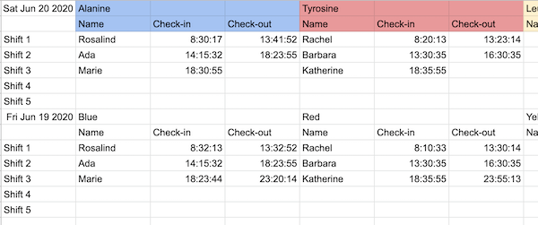  The second recording is an event log that records every check-in and check-out event forever (or until your google sheet runs out of cells). This could be useful in the event that contact tracing is necessary.  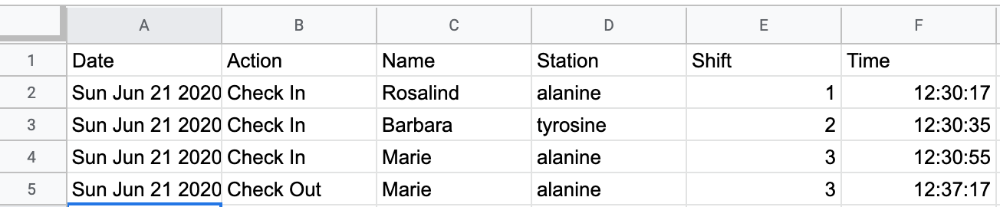  

The script also has optional functionality that sends messages to a slack channel every time someone checks in and checks out or if someone does not check-out of their shift. This can provide real-time updates to groups who have safety concerns of people working late at night or want to make sure everyone makes it to their shifts safely.  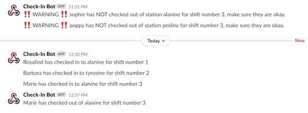  

The script is currently configured to have 4 stations and 3 shifts. It is easily customizable to have more or less stations and more or less shifts (up to 5).

This guide and the scripts were developed by Sophie Shoemaker, for any problems, please create a [github issue](https://github.com/sophieshoemaker/lab-slack-check-in/issues/new). I am happy to help with set-up issues and minor customization issues. However, if you are requesting custom functionality I may decline your request out of time constraints. 

#### Step 1: Set up the Google Sheet
  1. Copy the format of this [google sheet](https://docs.google.com/spreadsheets/u/1/d/1419TJO3wTIyPg9dQ2lypU2KLrEhKIq-41rd6MTtmKKE/edit?usp=sharing). Make sure you get both tabs (‘Current Day’ and ‘Event Log’). If you want to change the name of your stations, you can on the ‘Current Day’ tab, but later you will have to also make a change within the script. Ensure you DO NOT change the positions of the columns or rows, this will break the script. The dates in cells A1 and A8 can be changed to the current days date and will continually update with the new dates. 
  1. Instructions on how to add more or less stations or shifts are at the bottom of this tutorial

#### Step 2: Create a new Google Sheets App Script
  1. In the google sheet you just set up, create a new script in Tools>Script Editor. 
  1. Delete all of the text in the existing script (function MyFunction … etc) and copy in this [script](./google_sheets_script.js). 
      1. You can name this script at the top anything you want. It is not important.
      1. Save this
      1. This is the place that if you want to rename your stations, you should do it now. You will see these lines starting at line 7:  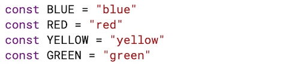
      1. Leave the variable names (BLUE, RED, YELLOW, GREEN) but change the part in the quotes. The order they are in is the order they appear in the sheet. So if you wanted your stations to be named Alanine, Tyrosine, Leucine and Proline you would want to change these lines to look like the following picture. DO NOT CHANGE ANY OTHER LINES. 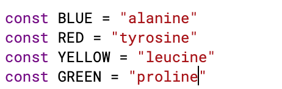
      1. If you make these changes make sure to save your script. 

#### Step 3: Integrate this function with slack
  1. Go to Publish>Deploy as web app and a window should pop up
  1. Fill it out to look like this (make sure it says “Anyone, even anonymous” under “Who has access to this app:") 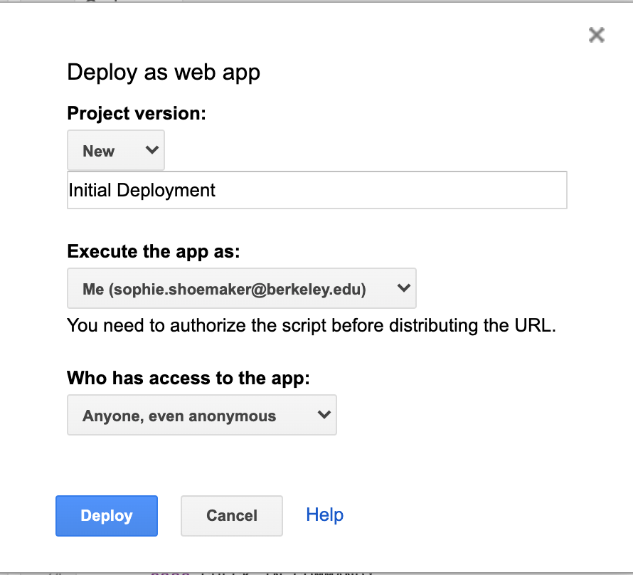 
      1. Whenever you make changes to the script you must go back to Publish>Deploy and then fill out the pop-up making sure the Project version is “New” every time. It is good practice to include a descriptive message of what you changed. Make sure everything else is still filled out. 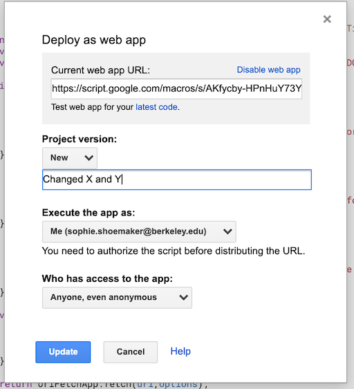
  1. Click deploy (it may ask you to login to your account to check permissions)
  1. Copy the URL in the box and click okay.
  1. Go to the [Slack API homepage](https://api.slack.com/) and click “Start Building”
  1. Give your app a name (e.g. “Check In Tool”)
  1. Click “Add features and functionality”
  1. Click “Slash Commands”
  1. Click “Create New Command”
  1. Fill it out to look like this, pasting in the URL that you copied in step 4 of this part: 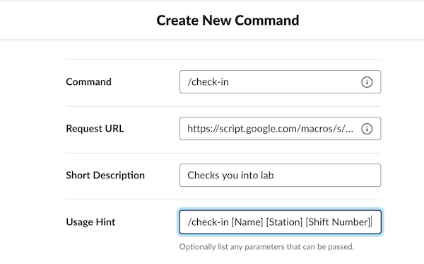
  1. Click Save
  1. Click “Create New Command”
  1. Fill it out to look like this, pasting in the URL that you copied in step 4 of this part: 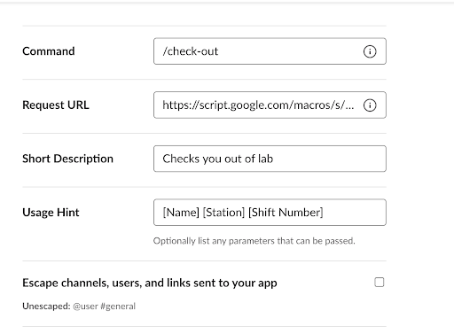
  1. Click Save
  1. On the left hand side click ‘Basic Information’ 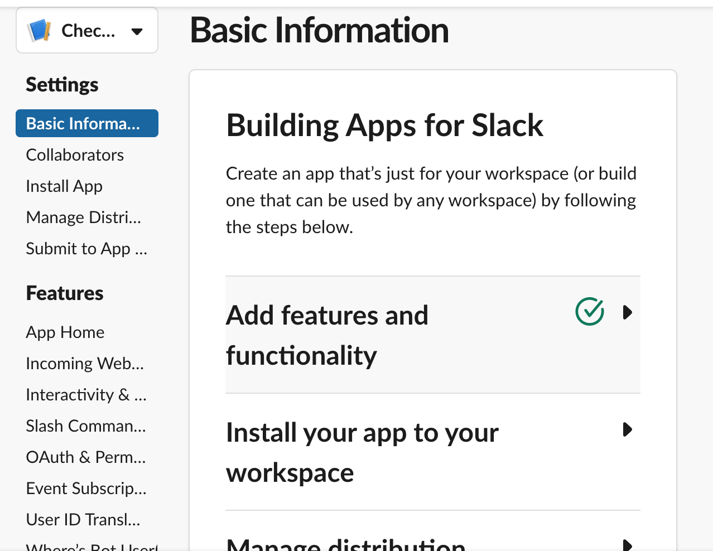
  1. Click on “Install your app to your workspace” (middle of page) and then click on the big green button that says “Install App to Workspace”
  1. You should be taken to a new page requesting permission to access the Slack workspace. Click “Allow”
#### Step 4: Test your app! 
  1. Go to your slack workspace. From ANY CHANNEL (would recommend either your Slackbot channel or your Direct message to yourself to reduce clutter)
  1. Put in a test check-in  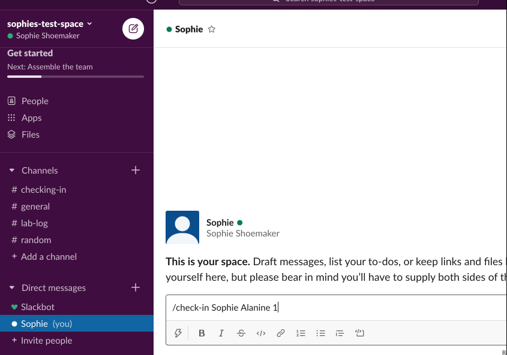   
      1. You should see the following message which indicates your check-in was successful. 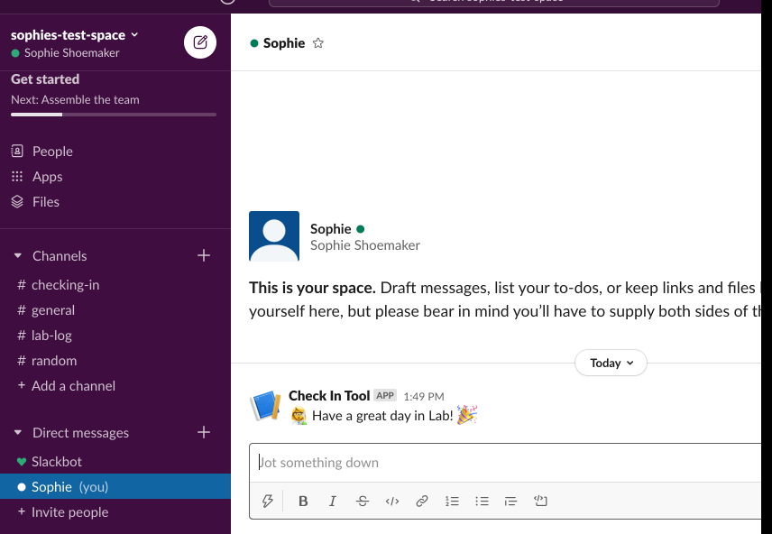   
  	  1. If you don’t see this message, it should give you a helpful error message of why it did not work. If it is a bunch of incomprehensible nonsense, make a github issue to help troubleshoot. 
  1. Go to the Google Sheet and see if your entry was logged on BOTH the “Current Day” and “Event Log” tabs.
  	    1. Current Day Sheet:  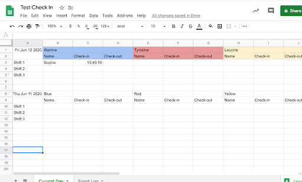        
        1. Event Log Sheet: 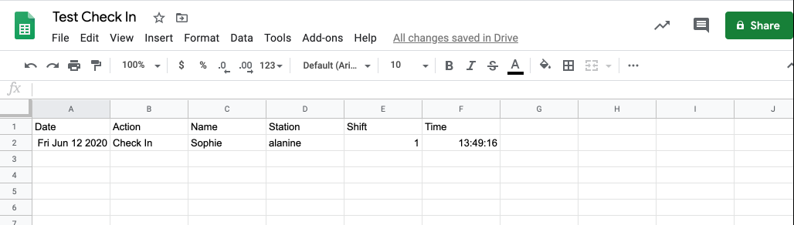      
  1. If you do not see these changes in your sheet, something is wrong. Maybe go back through the steps to make sure you didn’t miss something. Otherwise create a github issue.
  1. Similarly test your /check-out function (same way as above, but with the /check-out command). You should get a check-out message that says “See you next time”

#### Step 5: Set up the overnight autoclear
  1. Naturally at the end of the day, we will want to shift down responses on the “Current Day” sheet (so we have a 1 day log of who was where) so we are ready for the next day. 
  1. Go back to your Google Sheets App (created in Step 2) 
  1. In the tool bar click the “Current Triggers” button (it looks like a clock speech bubble) 
  1. This should take you to the “Triggers” page which currently should be empty. 
  1. Click “+ Add Trigger”
  1. Fill out the “Add Trigger for Testing” with the following parameters: 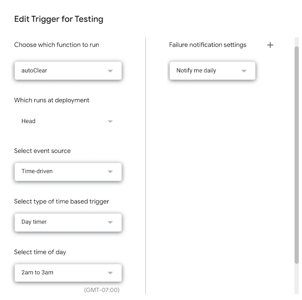  
  1. Click Save
  1. To test this part, I would recommend making some check-in’s and outs and then tomorrow morning checking the sheet to make sure that the daily entries were moved down to the previous spot. The dates on the sheet should also be updated. 
    1. Note this functionality does not change anything on the “Event Log” tab

#### Step 6: OPTIONAL create a slack channel to have all of the actions logged in Slack.
  1. This is optional, it just has messages sent to a slack channel in your workspace alerting people to who is checking into what station when. 
  1. In your slack workspace, create a slack channel where you want these messages to go to (mine is named #lab-check-in-log)
Set the const variable at the top of Google Sheets Script called “SEND_TO_SLACK” to true
  1. Change the const variable at the top of Google Sheets Script called “CHECK_IN_CHANNEL” to be the name of this channel (including the #)
  1. Go to the [slack incoming webhooks page](https://my.slack.com/services/new/incoming-webhook/)
  1. In the Post to Channel drop down select the channel you created. Click “Add integration”
  1. Copy the Webhook URL
  1. At the top of the google sheets script there is a variable called url, paste in the url you just copied.
  1. Test this out by checking someone in or out and see if it is posted to the channel you set up.

#### Step 7: OPTIONAL have Slack notify you if someone does NOT check out of their shift
  1. This is an optional function that will check after each shift to make sure everyone has checked out and if they have not send a warning message to the same slack channel as in step 6. If you only want step 7 functionality and not step 6, follow the instructions of step 6 except for part 3.
  1. Set the const variable WARN_IF_NO_CHECK_OUT at the top of the script to true.
  1. Starting in line 20, you will see const variables that are the times that each shift ends. Change these to be the times that you want to check if each shift has checked out.
    1. If you add more shifts (instructions to do that is near the end), add additional variables (i.e. const CHECKOUT_4 = 23) and then also add them to the const CHECKOUT_TIMES list. (i.e. const CHECKOUT_TIMES = [CHECKOUT_1, CHECKOUT_2, CHECKOUT_3, CHECKOUT_4]
  1. Now you need to set triggers for checking similar to what you did in Step 5 with the autoClear.
      1. First go to triggers
      1. Click the “+ Add Trigger” button in the bottom right corner.
      1. Fill out the options to look like this:   
      1. Change the “Select time of day” to match the hour at which your shift ends
      1. Repeat b and c for the other times that your shifts end. (i.e. if you have 3 shifts, you will need 3 triggers, one at each shift end time)
  1. You will need to save the script and publish it as described before.
  1. You should test this by signing yourself in and not out and then wait to see if the slack message is sent to the channel

#### Step 8: OPTIONAL decide how you want to handle check-in overrides
  1. So what happens if someone signs into the wrong station and then the other person needs to sign in. This is not a huge deal, because regardless of what the “Current Day” Sheet says, all of the check-in and check-out events are recorded in the Event Log, so you can sort out issues later. But you can decide how you want to handle what happens when this occurs. 
  1. By default the WARN option is initialized. This means that if Rosalind accidentally signs into Blue shift 1 (which is really Barbara’s shift), when Barbara goes to sign in she will get a message that says “You overrode Rosalind's check in to this station. Please check the schedule and make sure this is correct”. Barbara will realize what happened and let Rosalind know she made an error so she can fix it. Or if it was truly Rosalind’s shift and Barbara made the error, Barbara can apologize to Rosalind and sign Rosalind back in and sign herself into the correct shift. They can then also manually fix the entries in the event log or let someone know about the issue. 
  1. Another option is ALLOW. This would just allow Barbara to override Rosalind’s check-in, without alerting her. Then when Rosalind goes to check-out she will find she’s unable to and then will have to work with Barbara to figure out how to fix the event log.
  1. The last option is FORBID. This would tell Barbara that “You cannot check into this station because Rosalind is checked in”. Barbara would then have to figure out what went wrong with Rosalind and then contact whoever has editing permission on the google sheet and ask them to fix the blunder. This is the best option if you only want a supervisor to be allowed to override people through the google sheet.
  1. Choose an option, if it is ALLOW or FORBID, change the const variable “OVERRIDE_OPT” at the top of the shet. 

#### If you want to change the number of stations
  1. This is a bit more involved. If you want less stations, it’s fairly simple. Just delete the extra const variables (start with GREEN, then YELLOW, then RED) and then also delete them from the var stations list. This should just not allow anyone to check into the other stations. You can then delete these columns from the google sheet. So the top of the script should look like this with your station names. 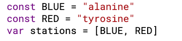
  1. If you want to add stations you will have to add more const variables for the stations and then add them to the list. You will also have to add the column that this station should report to in a variable called something like PURPLE_COL. Then in the getStationColumn function you will have to add the station name and column to the switch statement. So for example if I added 1 station my script would look like this starting at line 7: 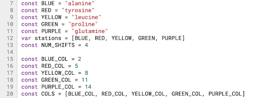
  1. Then you would just need to add the new column headers for the new station starting at column 14 (N).  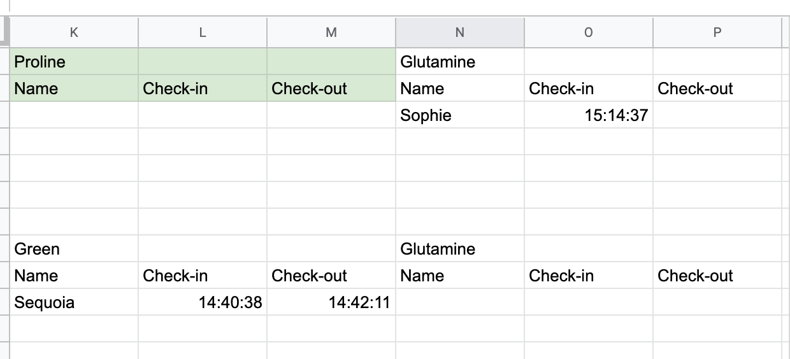

#### If you want to change the number of shifts
Currently this script only supports numbers of shifts between 1 and 5. Simply change the NUM_SHIFTS variable in line 13 to reflect the number of shifts you want. Then make sure to change the row titles in your Google Sheet.

If you want more than 5 shifts, you can try to figure out the code to how to add more. It’s not overly complicated but you’ll have to figure out where all of the writing to each set comes from. If you would like help doing this, contact me and I may be able to help.

### I hope these instructions were clear. Any feedback on how to clarify the instructions would be appreciated
### Enjoy!
