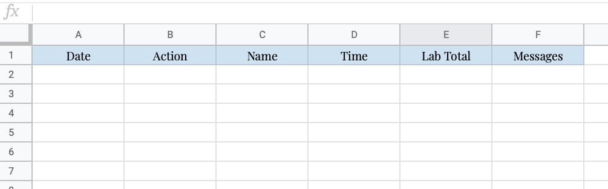

# Slack and Google Sheets Lab Check-In System Set Up

This is a step by step instruction page on how to set up a custom slack [slash-function](https://slack.com/help/articles/201259356-Use-built-in-slash-commands) that is integrated with a google sheet to log when lab members check in and out of the lab and to keep an active running tally of how many researchers are in lab. I made this app by copying and then editing the app developed by Sophie Shoemaker. Our lab does not need shifts, so these were removed. I am absolutely not a professional app developer or even an advanced programmer, so please be understanding if something isn’t working exactly how you want it to. However, I tried my best to make it customizable and easy to use and I am  happy to help answer questions.

### What this Script Does
This script provides two main functions:
1. A simple way for lab members to check into and out of lab with a slack slash command. It records these check-in and check-out events in a google sheet in 2 ways. The first way is a sheet called Current Day which is a quick overview of the most recent incidence of the person who has checked into and out of lab during the current day and the previous day.    The second recording is an event log that records every check-in and check-out event forever (or until your google sheet runs out of cells). This could be useful in the event that contact tracing is necessary.    

1. A current running count of the number of researchers in lab. 

1. The script will check and 3 AM to see if anyone forgot to log out. If so, it will log them out and issue a message to slack

1. The script is currently configured to accommodate labs containing up to 10 researchers. It is easily customizable to have more or less people.

#### Script Options
The script  has optional functionality that sends messages to a slack channel every time someone checks in and checks out or if someone does not check-out of their shift. This can provide real-time updates to groups who have safety concerns of people working late at night or want to make sure everyone makes it through their shift safely.    

This guide and the scripts were mainly developed by Sophie Shoemaker. I copied her code and her README and edited for my purposes. For any problems, please create a [github issue](https://github.com/sophieshoemaker/lab-slack-check-in/issues/new). I am happy to help with set-up issues and minor customization issues. However, if you are requesting custom functionality I will likely decline your request out of time constraints. 

If you find that this tool is really useful for your lab and you think that under non-pandemic times you might have offered to buy me a coffee, feel free to pass that sentiment along to Sophie by [buying her a virtual coffee](https://www.buymeacoffee.com/sophieshoemaker). From now until the end of July, all donations received will be re-donated to [Community Resources for Science](https://www.crscience.org/) which is an amazing organization that provides resources and support for schools in the Bay Area to facilitate science experiences for students, especially for low-income schools. In this time of distance learning and inequity in STEM, their mission is of utmost importance. Help me help them!

### Alright now onto the set up

#### Step 1: Set up the Google Sheet
  1. Copy the format of this [google sheet](https://docs.google.com/spreadsheets/d/1_fziBWKw3_1COrPGRok5XPv9mmuV5GmZfYSHKXxeSBU/edit?usp=sharing). Make sure you get both tabs (‘Current Day’ and ‘Event Log’). Change the name of your people on the ‘Current Day’ tab, and later you will have to also change the names within the script. These two names must be the same. I currently use one-word (no spaces) first names. Ensure you DO NOT change the positions of the columns or rows, this will break the script. Even if you have less than 10 people, make sure to leave all of the rows in the sheet template (i.e. yesterdays date should be in A14 because you did not move anything). The dates in cells A1 and A14 can be changed to the current days date and will continually update with the new dates once you have the script running. Cell B1 contains the current number of researchers in lab.
  1. Instructions on how to add more people are at the bottom of this tutorial

#### Step 2: Create a new Google Sheets App Script
  1. In the google sheet you just set up, create a new script in Tools>Script Editor. 
  1. Delete all of the text in the existing script (function MyFunction … etc) and paste in this [script](./google_sheets_script.js). 
      1. You can name this script at the top anything you want. It is not important.
      1. Save this
      1. Edit this script to set the names of the personnel variables (e.g. // Personnel variables) to equal those names you entered into the google sheet. 
      1. In my case, I would change "name_01" to "Karen" in both the google sheet Current Day and within the script.
      1. Edit the NAME_ERR message accordingly (only do not use the quotes for "name_01" and "Karen", just change name_01 to Karen). This error message will be triggered if someone uses a name that is not on the google sheet.
      1. DO NOT CHANGE ANY OTHER LINES. !
      1. After making these changes make sure to save your script. 

#### Step 3: Integrate this function with slack
  1. Go to Publish>Deploy as web app and a window should pop up
  1. Fill it out to look like this (make sure it says “Anyone, even anonymous” under “Who has access to this app:")  
      1. Whenever you make changes to the script you must go back to Publish>Deploy and then fill out the pop-up making sure the Project version is “New” every time. It is good practice to include a descriptive message of what you changed. Make sure everything else is still filled out. 
  1. Click deploy (it may ask you to login to your account to check permissions)
  1. Copy the URL in the box and click okay.
  1. Go to the [Slack API homepage](https://api.slack.com/) and click “Start Building”
  1. Give your app a name (e.g. “Check In Tool”)
  1. Click “Add features and functionality”
  1. Click “Slash Commands”
  1. Click “Create New Command”
  1. Fill it out to look like this, pasting in the URL that you copied in step 4 of this part: 
  1. Click Save
  1. Click “Create New Command”
  1. Fill it out to look like this, pasting in the URL that you copied in step 4 of this part: 
  1. Click Save
  1. On the left hand side click ‘Basic Information’ 
  1. Click on “Install your app to your workspace” (middle of page) and then click on the big green button that says “Install App to Workspace”
  1. You should be taken to a new page requesting permission to access the Slack workspace. Click “Allow”
#### Step 4: Test your app! 
  1. Go to your slack workspace. From ANY CHANNEL (would recommend either your Slackbot channel or your Direct message to yourself to reduce clutter)
  1. Put in a test check-in     
      1. You should see the following message which indicates your check-in was successful.    
  	  1. If you don’t see this message, it should give you a helpful error message of why it did not work. If it is a bunch of incomprehensible nonsense, try to read the garbled stuff to find the error message or make a github issue to help troubleshoot. 
  1. Go to the Google Sheet and see if your entry was logged on BOTH the “Current Day” and “Event Log” tabs.
  	    1. Current Day Sheet:          
        1. Event Log Sheet:       
  1. If you do not see these changes in your sheet, something is wrong. Maybe go back through the steps to make sure you didn’t miss something. Otherwise create a github issue.
  1. Similarly test your /check-out function (same way as above, but with the /check-out command). You should get a check-out message that says “See you next time”

#### Step 5: Set up the middle-of-the-night auto check-out
  1. Because the script is keeping a live count of the number of researchers in lab, it is problematic if people forget to log out. This script checks for occurences of no check outs and automatically logs people out. I have it set to automatically run at 3 AM before the Step 6 autoclear below. Your needs might be different. If the script finds a check-in with no check-out, it will do two things: (1) it will check out the person; and (2) it will put "automatic check-out" in the "Message" column of the sheet. If slack messages are enabled, it will also send a message to slack.
  1. Set the const variable WARN_IF_NO_CHECK_OUT at the top of the script to true.
  1. Go back to your Google Sheets App (created in Step 2) 
  1. In the tool bar click the “Current Triggers” button (it looks like a clock speech bubble) 
  1. This should take you to the “Triggers” page which currently should be empty. 
  1. Click “+ Add Trigger”
  1. Fill out the “Add Trigger for Testing” with the following parameters:   
  1. Click Save
  1. To test this part, I would recommend making some check-ins without check-outs and then tomorrow morning checking the sheet to make sure that the daily entries were moved down to the previous spot. The dates on the sheet should also be updated. 
  

#### Step 6: Set up the overnight autoclear
  1. Naturally at the end of the day, we will want to shift down responses on the “Current Day” sheet (so we have a 1 day log of who was where) so we are ready for the next day. I have this script set to run at 4 AM, so that the "no-check-out" script  (Step 5) runs first to clean up the log. 
  1. Go back to your Google Sheets App (created in Step 2) 
  1. In the tool bar click the “Current Triggers” button (it looks like a clock speech bubble) 
  1. This should take you to the “Triggers” page which currently should be empty. 
  1. Click “+ Add Trigger”
  1. Fill out the “Add Trigger for Testing” with the following parameters:   
  1. Click Save
  1. To test this part, I would recommend making some check-ins and outs and then tomorrow morning checking the sheet to make sure that the daily entries were moved down to the previous spot. The dates on the sheet should also be updated. 
    1. Note this functionality does not change anything on the “Event Log” tab

#### Step 7: OPTIONAL create a slack channel to have all of the actions logged in Slack.
  1. This is optional, it just has messages sent to a slack channel in your workspace alerting people to who is checking into what station when. 
  1. In your slack workspace, create a slack channel where you want these messages to go to (mine is named #lab-check-in-log)
Set the const variable at the top of Google Sheets Script called “SEND_TO_SLACK” to true
  1. Change the const variable at the top of Google Sheets Script called “CHECK_IN_CHANNEL” to be the name of this channel (including the #)
  1. Go to the [slack incoming webhooks page](https://my.slack.com/services/new/incoming-webhook/)
  1. In the Post to Channel drop down select the channel you created. Click “Add integration”
  1. Copy the Webhook URL
  1. At the top of the google sheets script there is a variable called url, paste in the url you just copied.
  1. Test this out by checking someone in or out and see if it is posted to the channel you set up.
      1. REMEMBER: Whenever you make changes to the script you must go back to Publish>Deploy and then fill out the pop-up making sure the Project version is “New” every time. It is good practice to include a descriptive message of what you changed. Make sure everything else is still filled out. 

      
#### Step 8: OPTIONAL decide how you want to handle it if someone tries to check-in and the lab maximum has already been reached
  1. So what happens if the lab maximum has already been reached and someone tries to check in? At our university, an additional person is allowed to temporarily enter the lab to complete a short (<1 hour) task. You can decide how you want to handle what happens when this occurs. 
  1. By default the WARN option is initialized. This means that if someone sends a check-in command, it will be allowed and they will receive a warning: “WARNING: There are now xx total researchers in lab. This exceeds our max allowed of LAB_LIMIT so make your visit brief." If slack is enabled, everyone will receive the notice that this is ahppening and it can be worked out in person. 
  1. Another option left of from Sophie's code is ALLOW. We are not currently using that functionality.
  1. The last option is FORBID. This would tell the person trying to check in that “You cannot check into this station because the lab maximum has been reached”. 
  1. Choose an option, if it is ALLOW or FORBID, change the const variable “OVERRIDE_OPT” at the top of the shet. 

#### If you want to change the number of people in lab
Currently this script only supports up to 10 people in lab. If you have fewer people, just ignore the extra entries and leave the name variables as default.  

If you have more than 10 people, you will need to figure out the code to determine how to edit the google sheet and the code. It’s not overly complicated but you’ll have to figure out where all of the writing to each set comes from. If you would like help doing this, contact me and I may be able to help.

### I hope these instructions were clear. Any feedback on how to clarify the instructions would be appreciated
### Enjoy!
